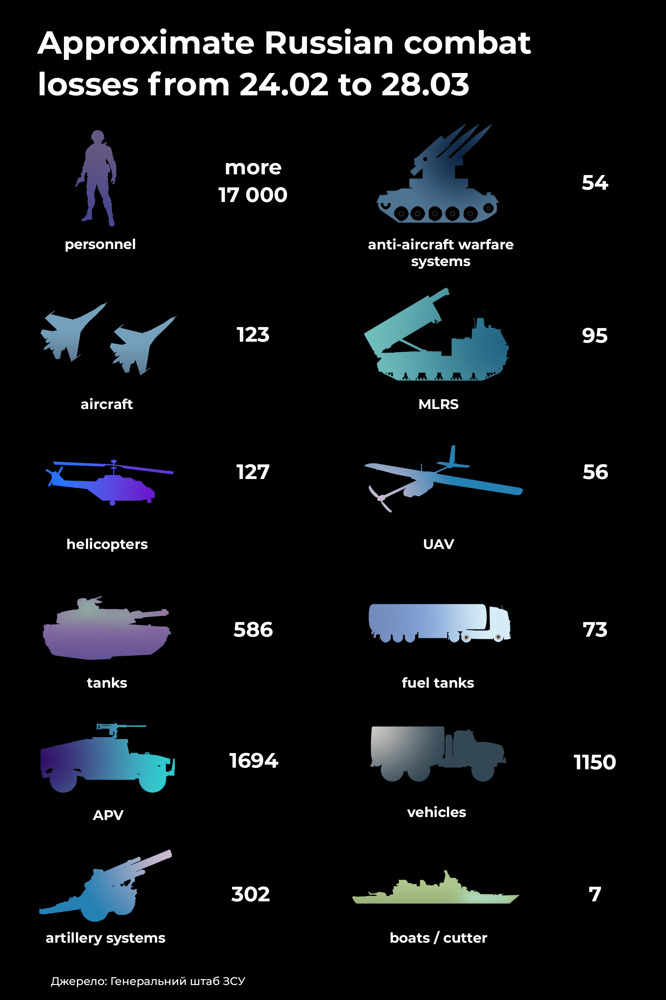

# Российское вторжение в Украину (2022) Російське вторгнення в Україну (2022)  Russian invasion of Ukraine (2022)

*Репозиторий создан для предотвращения сокрытия информации о войне в Украине для жителей Российской Федерации.* 
*Репозиторій створений для запобіганню приховування інформації стосовно війни в Україні для жителів Російської Федерації.* 
*The repository was created to prevent the concealment of information about the war in Ukraine for residents of the Russian Federation.*

Ссылка на оригинал статьи: [Российское вторжение в Украину](https://uk.wikipedia.org/wiki/%D0%A0%D0%BE%D1%81%D1%96%D0%B9%D1%81%D1%8C%D0%BA%D0%B5_%D0%B2%D1%82%D0%BE%D1%80%D0%B3%D0%BD%D0%B5%D0%BD%D0%BD%D1%8F_%D0%B2_%D0%A3%D0%BA%D1%80%D0%B0%D1%97%D0%BD%D1%83_(2022))

[(Читать на русском)](#Russian)
[(Читати українською)](#Ukrainian)
[(Read in english)](#English)

# Russian:
Российское вторжение в Украину 2022 года – открытое военное нападение России на Украину, начатое 24 февраля, в 5 часов утра 2022 года. Вторжение является частью российско-украинской войны, развязанной Россией 2014 года, участие в которой Россия постоянно отрицала.

Военная кампания началась после длительного наращивания российских войск с ноября 2021 г. вдоль границы Украины с РФ и Беларусью и признания органами власти России 21 февраля 2022 г. террористических образований на территории Украины — «ДНР» и «ЛНР» — как государственных образований. Неоднократно разные СМИ, западные и украинские политики расценивали накопления российских войск у границ с Украиной как подготовку России к войне с Украиной. Практически одновременно Вооруженные силы Российской Федерации начали нескрываемый переброс дополнительных войск на оккупированные территории Донецкой и Луганской областей.

Около 5 часов по киевскому времени 24 февраля президент РФ Владимир Путин объявил о военной операции якобы с целью «демилитаризации и деницификации Украины»; Через несколько минут начались ракетные удары по всей Украине, в том числе вблизи Киева. Российские войска ворвались в Украину вблизи Харькова, Херсона, Чернигова, Сум, войдя из России, Белоруссии и временно оккупированного Россией Крыма. Вместе с Россией войну против Украины ведет и Беларусь, из приграничных районов которой наносят ракетные удары по территории Украины и которая впоследствии ввела свои войска. Контролируемое Россией Приднестровье (Молдова) также представляет собой потенциальную угрозу.

Благодаря сопротивлению украинской армии и сил самообороны уже в первые дни агрессии российская армия понесла значительные потери в живой силе и технике. В своей новейшей истории, по оценкам Украины, Россия во всех войнах, которые она вела, еще не терпела даже примерно таких больших потерь за столь короткое время. По признанию западной разведки, Россия встретила более сильное, чем ожидалось, сопротивление, что обусловило материально-технические проблемы для ее войск, нехватку горючего, боеприпасов и продовольствия, подрыв боевого духа нападающих. Быстрое объединение стран мира для помощи Украине, как и введение мощных санкций против России, явилось неожиданным ударом для страны-агрессора.

##### С первого дня вторжения Россия нарушает правила ведения войны и массово совершает военные преступления.

# Ukrainian:

Російське вторгнення в Україну 2022 року — відкритий воєнний напад Росії на Україну, розпочатий 24 лютого, в 5 годині ранку 2022 року. Вторгнення є частиною російсько-української війни, розв'язаної Росією 2014 року, участь у якій Росія постійно заперечувала.

Військова кампанія почалася після тривалого нарощування російських військ з листопада 2021 року вздовж кордону України з РФ і Білоруссю та визнання органами влади Росії 21 лютого 2022 р. терористичних утворень на території України — «ДНР» і «ЛНР» — як державних утворень. Неодноразово різні ЗМІ, західні та українські політики розцінювали накопичення російських військ біля кордонів з Україною як підготовку Росії до війни з Україною. Практично одночасно Збройні сили Російської Федерації почали неприховане перекидання додаткових військ на окуповані території Донецької і Луганської областей.

Близько 5 години за київським часом 24 лютого президент РФ Володимир Путін оголосив про військову операцію нібито з метою «демілітаризації та денацифікації України»; через кілька хвилин почалися ракетні удари по всій Україні, в тому числі поблизу Києва. Російські війська вдерлися до України поблизу Харкова, Херсона, Чернігова, Сум, увійшовши з Росії, Білорусі та тимчасово окупованого Росією Криму. Разом із Росією війну проти України веде й Білорусь, з прикордонних районів якої завдають ракетних ударів по території України і яка згодом ввела свої війська. Контрольоване Росією Придністров'я (Молдова) також є потенційною загрозою.

Завдяки спротиву української армії і сил самооборони вже в перші дні агресії російська армія зазнала значних втрат у живій силі і техніці. У своїй новітній історії, за оцінками України, Росія в усіх війнах, які вона вела, ще не зазнавала навіть приблизно таких великих втрат за такий короткий час. За визнанням західної розвідки, Росія зустріла сильніший, ніж очікувалося, опір, що зумовило матеріально-технічні проблеми для її військ, нестачу пального, боєприпасів і продовольства, підрив бойового духу нападників. Швидке об'єднання країн світу для допомоги Україні, як і запровадження потужних санкцій проти Росії, стало несподіваним ударом для країни-агресора.

##### З першого дня вторгнення Росія порушує правила ведення війни і масово чинить воєнні злочини.

# English:
The Russian invasion of Ukraine in 2022 is an open military attack by Russia on Ukraine, launched on February 24, at 5 am in 2022. The invasion is part of the Russian-Ukrainian war waged by Russia in 2014, in which Russia has consistently denied participation.

The military campaign began after a long build-up of Russian troops in November 2021 along Ukraine's border with Russia and Belarus and the recognition by Russian authorities on February 21, 2022 of terrorist groups in Ukraine - "DPR" and "LPR" - as state entities. Various media outlets, Western and Ukrainian politicians have repeatedly viewed the accumulation of Russian troops near the Ukrainian border as Russia's preparation for war with Ukraine. Almost simultaneously, the Armed Forces of the Russian Federation began the undisguised transfer of additional troops to the occupied territories of Donetsk and Luhansk regions.

At about 5 o'clock Kyiv time on February 24, Russian President Vladimir Putin announced a military operation allegedly aimed at "demilitarization and denazification of Ukraine"; a few minutes later, missile strikes began throughout Ukraine, including near Kiev. Russian troops invaded Ukraine near Kharkiv, Kherson, Chernihiv, and Sumy, entering from Russia, Belarus, and the Russian-occupied Crimea. Along with Russia, Belarus is waging war against Ukraine, from whose border areas missile strikes are being launched on the territory of Ukraine and which later deployed its troops. Russia-controlled Transnistria (Moldova) is also a potential threat.

Due to the resistance of the Ukrainian army and self-defense forces, already in the first days of the aggression, the Russian army suffered significant losses in manpower and equipment. In its recent history, according to Ukraine, in all the wars it has waged, Russia has not suffered even such great losses in such a short time. According to Western intelligence, Russia met with stronger resistance than expected, which led to logistical problems for its troops, lack of fuel, ammunition and food, undermining the fighting spirit of the attackers. The rapid unification of the world to help Ukraine, as well as the imposition of strong sanctions against Russia, came as a surprise blow to the aggressor country.

##### From the first day of the invasion, Russia violates the rules of war and commits mass war crimes.